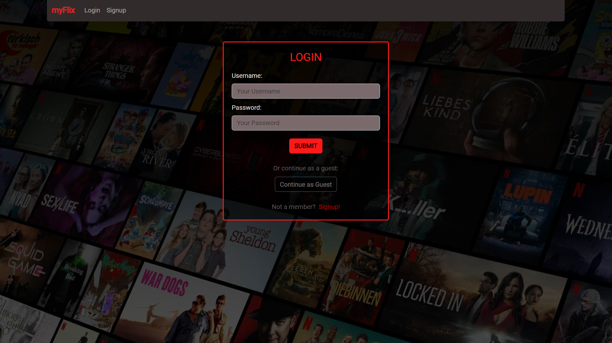
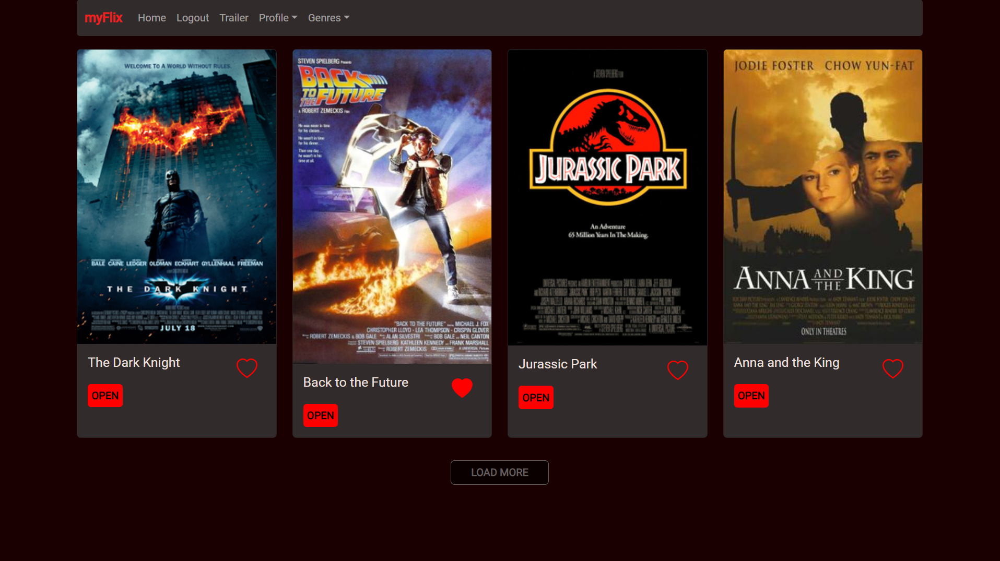

# The client-side component of myFlix

## Table of contents

-   [Introduction](#introduction)
-   [Screenshots to represent the project](#screenshots-to-represent-the-project)
-   [Tasks in the project](#tasks-in-the-project)
-   [Link to the App](#link-to-the-app)
-   [Essential Views and Features](#essential-views-and-features)
-   [Technologies](#technologies)
-   [Dependencies](#dependencies)
-   [Instruct Parcel to build the project](#instruct-parcel-to-build-the-project)
-   [References](#references)

### Introduction

The aim of this project was to build the client-side component of a “myFlix” web application. The web application provide users with access to information about different movies, directors, and genres. Users are able to sign up, update their personal information, and create a list of their favorite movies.

### Screenshots to represent the project

### Tasks in the project

-   Create a single page application with React.
-   Used previously created server-side component of a “myFlix” and connected it for this newly designed Frontend structure.
-   Pulled the data to be dynamically displayed through the application.

### Link to the App

A link to the live, hosted version of the app: [https://movie-myflix-c346f5fde8cf.herokuapp.com/](https://movie-myflix-c346f5fde8cf.herokuapp.com/)

### Essential Views and Features

#### Main View

-   Returns ALL movies to the user (each movie item with an image and title)
-   Allows users to add/remove a movie to their list of favorites
-   Ability to select a movie for more details
-   Return NavigationBar:

    -   Filtering the list of movies by genres with a Dropdown
    -   Ability to log out
    -   Ability to navigate to Profile/ Update Profile/Favorite Movies and Delete Profile view

#### Single Movie View

-   Returns data (description, genre, director, image) about a single movie to the user

#### Login View

-   Allows users to log in with a username and password
-   Allows users to log in as a "Guest"

#### Signup View

-   Allows new users to register (username, password, email, date of birth)

#### Profile View

-   Displays user registration details

#### Update Profile View

-   Allows users to update their info (username, password, email, date of birth)

#### Favorite Movies View

-   Displays favorite movies
-   Allows users to remove a movie from their list of favorites

#### Delete Profile View

-   Allows existing users to deregister

### Technologies

This application was built using the MERN stack:

-   MongoDB (with MongoDB Atlas)
-   Express
-   React
-   Node.js

### Dependencies

-   Bootstrap
-   Prop-types
-   React
-   React-Bootstrap
-   React-dom
-   React-router
-   React-router-dom
-   React-youtube
-   Parcel

### Instruct Parcel to build the project

To build the project using Parcel, use the following terminal command:

`npx parcel src/index.html`

or

`npm run start`

To see the rendered result, open browser and navigate to **“http://localhost:1234”**.

### References

1.  Reference  
    Description: Heroku is a platform as a service (PaaS) that enables developers to build, run, and operate applications entirely in the cloud.  
    Product: Heroku  
    Date: 13/11/2023  
    [https://www.heroku.com/](https://www.heroku.com/)

2.  Reference  
    Description: MongoDB Atlas is a multi-cloud database service by the same team that build MongoDB. Atlas simplifies deploying and managing databases while offering the versatility to build resilient and performant global applications on the cloud providers of choice.  
    Product: MongoDB Atlas  
    Date: 23/10/2023  
    [https://www.mongodb.com/cloud/atlas/register](https://www.mongodb.com/cloud/atlas/register)

3.  Reference  
    Description: Netlify is a remote-first cloud computing company that offers a development platform that includes build, deploy, and serverless backend services for web applications and dynamic websites.  
    Product: Netlify  
    Date: 24/11/2023  
    [https://www.netlify.com/](https://www.netlify.com/)
